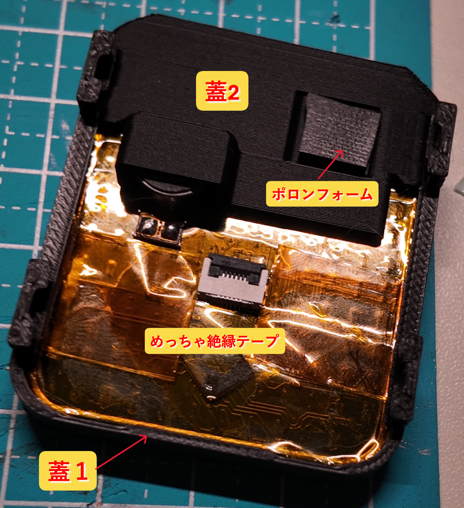
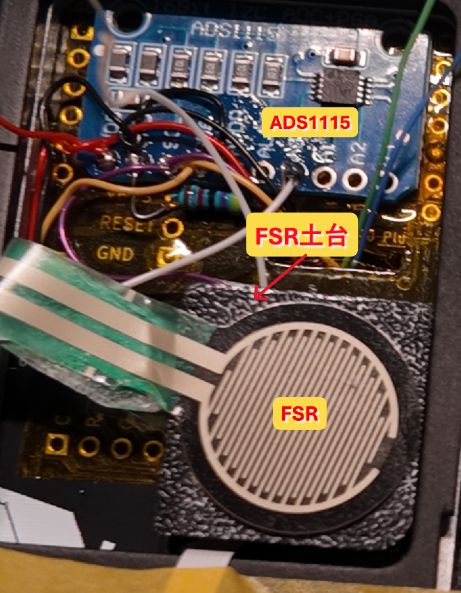
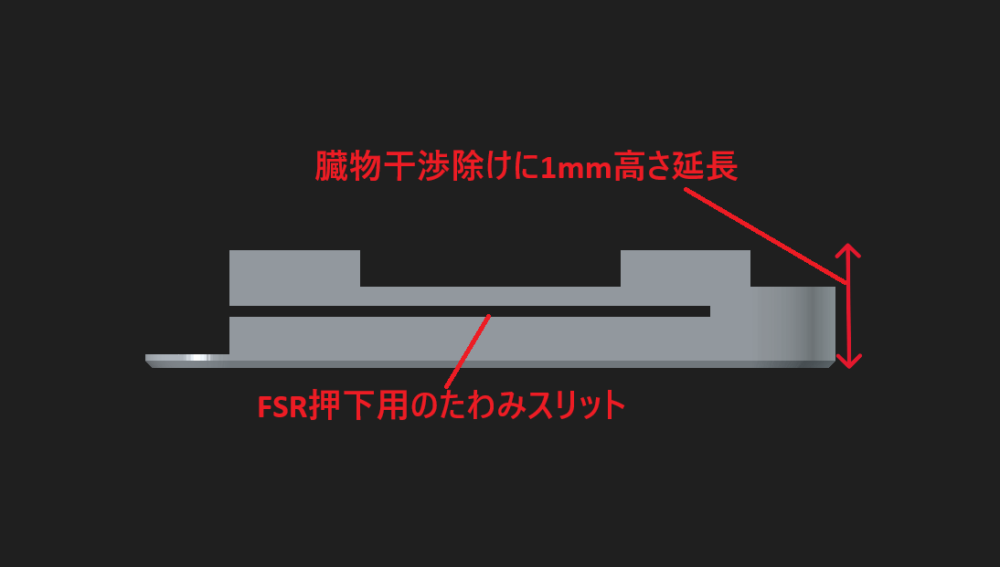
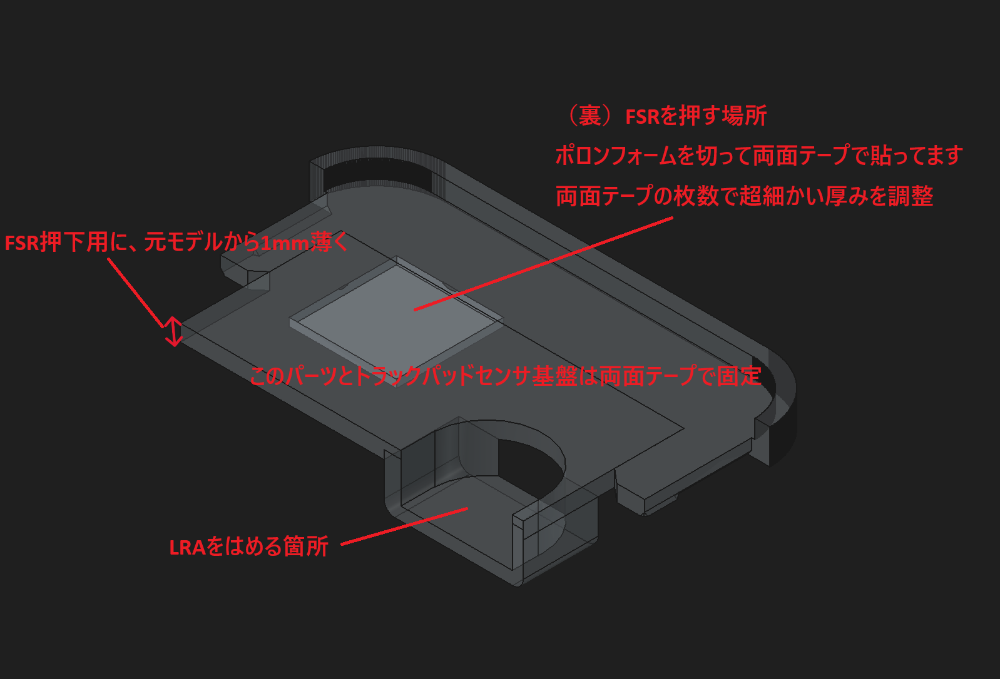
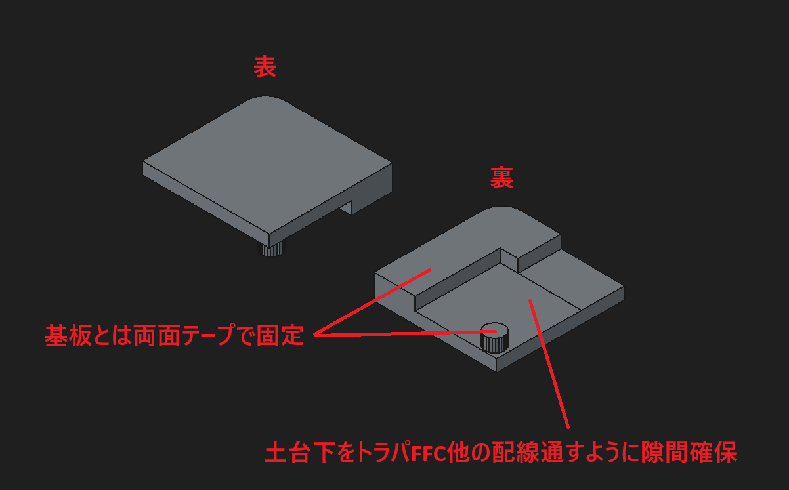

# 機構メモ

この文書は、LaLaPad Gen2 haptic / force feedback 実験における現状の機構メモです。

正式な組み立て手順書ではありません。
あくまで、1つの試作機の実験ログとして共有します。

実験用に改造したパーツの3Dモデルは [`hardware/modified-parts/`](../../../hardware/modified-parts/) に置いていますが、現時点では、本来共有に足るレベルの出来ではありません。あくまで参考情報として扱ってください。
既製品パーツや配線については、 [HARDWARE_AND_PIN_PLAN.md](./HARDWARE_AND_PIN_PLAN.md) を参照してください。

---

## 構成概要

機構としては、下記画像の通り、キーボード片側につき3つのパーツを制作しています。
- 蓋1
- 蓋2
- FSR土台

トラックパッドセンサ基板裏に絶縁テープを貼る。意味があるかは不明。。私は4重くらいに貼ってます。

ADS1115 をトラックパッド下の空間に配置、両面テープ固定。

DRV2605L は本体基板下の空間に配置、こちらも両面テープ固定しています。

  

---

## 蓋1(pad-lid-1-hapticmod)

トラックパッドセンサ基板を挟むパーツ。
ベースモデルに対し、以下を実施しました。
- 臓物干渉避けのため、1mmの高さ延長
  - （別に延長いらなかったかもしれない）
- FSR押下用に、1mmのたわみスリット追加

スリットを追加したことによって、本体との地続き構造が細くなり、結果として振動が伝わりやすくなる効果も出ている、きっと。

下記画像は横から見た図です。

---

## 蓋2(pad-lid-2-hapticmod_L/R)

ベースモデルでは本来、蓋1にはめ込んでトラックパッドセンサ基板を固定するパーツ。
この改造では、腕不足によりはめ込み式ではなく、トラックパッドセンサ基板に両面テープで固定しています。

ベースモデルに対し、以下を実施しました。
- LRAをはめる場所を追加
- FSR押下用に、1mm薄く変更
- FSR押下用に、裏に PORON フォームを両面テープで接着

---

## FSRベース(fsr-base-hapticmod_L/R)

FSRベースに FSR を貼り付け、蓋2に接着した PORON フォームで押下することで圧力検知します。
ベース下部に隙間を設け、トラックパッド FFC やほかの配線が通るようにしています。
本体基板とは両面テープで固定しています。

---

## 注意点

- 推測ですが、トラックパッド基板を強く押しすぎたり、たわませすぎたりすると、指の検知本数がおかしくなります。
  - コンマミリ単位での押下機構高さ調整により、それなりに安定するようになります。
  - 手元では FSR 押下用 PORON フォームを蓋2と接着する両面テープを重ね貼りしたりして調整しています。
- 操作感については、押下閾値 `FORCE_THRESHOLD` の調整や、プルダウン抵抗の抵抗値調整も有効です。

---

## 既知の課題・ほかメモ

- どれも素人仕事のためアレな出来ですが、特に蓋1に関しては多くの問題を抱えています。
  - 本体固定時の強度不足（普通に脚が折れたりします。）
  - たわみスリットがトラックパッド下部にしかないため、トラックパッド上部を押下できない・押下しても振動FBが感じづらい
  - 蓋2との固定機構が両面テープ
  - etc..
- FSR押下機構の調整が難しい。（左右同じように作っても、違う調整が必要だったり）
- LRA振動を最大限活かせていない。
  - 現状は操作面に対して鉛直方向の配置だが、水平方向振動の方が指先に感じやすい可能性。
  - 蓋1の脚や蓋2の固定機構も、振動伝達の観点でもっといいものがある筈。
- アナログ値で FSR 圧力を読めるようにしたものの、現時点ではあまり活かせていない。
- トラックパッドの本体取り付け時の配線の取り回し。FFCを変に巻き込まないように、FSRと押下面に挟まないように、、と気を遣う。

